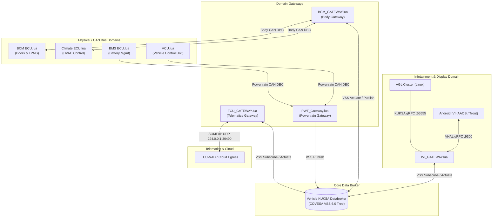

# 🚗 VIVA Automotive Gateway & ECU System

Tài liệu này hướng dẫn chi tiết về cấu trúc, chức năng và cơ chế hoạt động của các file kịch bản Lua trong thư mục **`GATEWAY/`**. 

Hệ thống được thiết kế theo kiến trúc **Zonal & Domain Gateway** kết nối qua **Vehicle KUKSA Databroker** (chuẩn dữ liệu xe hơi **COVESA VSS 6.0**), đóng vai trò làm cầu nối giữa các mạng CAN nội bộ, giao thức SOME/IP (Telematics), Android IVI VHAL gRPC và cụm đồng hồ điều khiển AGL Cluster.

---

## 📐 1. Sơ đồ Kiến trúc Tổng thể (Architecture Diagram)



---

## 📁 2. Danh mục & Chi tiết các File (File Catalog)

Thư mục bao gồm **8 file Lua**, được chia làm 2 nhóm chính: **Domain Gateways (Cầu nối)** và **Virtual ECUs (Mô phỏng phần cứng)**.

### 🌉 Nhóm 1: Domain Gateways (Cầu nối miền tín hiệu & Giao thức)

| Tên File | Vai trò & Chức năng | Giao thức / Interfaces |
| :--- | :--- | :--- |
| [`IVI_GATEWAY.lua`](file:///E:/FPT%20Automotive%20-%20VIVA%20Project/GATEWAY/IVI_GATEWAY.lua) | **Infotainment Gateway (IVI Bridge)**<br>• Cầu nối giữa KUKSA Databroker và gRPC Server (:9300) của Android IVI Head Unit (AAOS Trout VHAL).<br>• Chuyển đổi mã hóa thuộc tính (VSS Signal ↔ VHAL Property IDs tiêu chuẩn AOSP & Vendor `0x21XXXXXX`).<br>• Forward toàn bộ tín hiệu VSS trực tiếp sang AGL Cluster (`10.99.0.3:55555`).<br>• Áp dụng cơ chế khử trùng lặp tín hiệu (`push_if_changed`) tối ưu Binder. | • gRPC VHAL Server (`pins.vhal`) <br>• KUKSA Client (`pins.kuksa`) <br>• Ethernet AGL (`pins.eth`) |
| [`BCM_GATEWAY.lua`](file:///E:/FPT%20Automotive%20-%20VIVA%20Project/GATEWAY/BCM_GATEWAY.lua) | **Body Control Gateway (Body CAN Bridge)**<br>• Dịch lệnh ghi từ KUKSA (HVAC, Khóa cửa) thành khung truyền CAN Command.<br>• Phản chiếu khung CAN Status (HVAC, Cửa, Áp suất lốp, Trạng thái nguồn, Dây an toàn) về VSS Current.<br>• Chuyển tiếp tín hiệu liên miền (*Cross-domain*): Đọc `Vehicle.Speed` từ Powertrain phát lại lên Body CAN làm `PWT_VehicleSpeed` (0x460) cho vECU Dây an toàn. | • Body CAN (`pins.can`) <br>• KUKSA Client (`pins.kuksa`) |
| [`PWT_Gateway.lua`](file:///E:/FPT%20Automotive%20-%20VIVA%20Project/GATEWAY/PWT_Gateway.lua) | **Powertrain Gateway (Powertrain CAN Bridge)**<br>• Cầu nối **Read-only** đọc trạng thái từ Powertrain CAN lên KUKSA.<br>• Cập nhật các thông số chuyển động EV (Tốc độ xe, Vòng tua động cơ điện, Odometer), năng lượng (SoC pin, Điện áp, Dòng điện, Nhiệt độ pin, Tầm hoạt động còn lại) và hệ truyền động (Cần số PRNDL, Chế độ lái). | • Powertrain CAN (`pins.can`) <br>• KUKSA Client (`pins.kuksa`) |
| [`TCU_GATEWAY.lua`](file:///E:/FPT%20Automotive%20-%20VIVA%20Project/GATEWAY/TCU_GATEWAY.lua) | **Telematics Control Unit Gateway (SOME/IP Bridge)**<br>• Cung cấp Dịch vụ SOME/IP Provider (`Service 0x2000` / `Instance 0x0001`) chạy trên Ethernet `e-eth`.<br>• Bắn dữ liệu Telemetry (VSS Update dưới dạng JSON payload) qua Event `0x8001` đến TCU-NAD kết nối Cloud.<br>• Nhận lệnh điều khiển từ xa qua SOME/IP Method `0x9001` (`SetDoorLock`) và ghi vào KUKSA. | • SOME/IP over Ethernet (`e-eth`) <br>• KUKSA Client (`pins.kuksa`) |

---

### ⚡ Nhóm 2: Virtual ECUs & Simulators (Mô phỏng phần cứng & Cảm biến)

| Tên File | Vai trò & Chức năng | Giao diện đầu vào / Pins |
| :--- | :--- | :--- |
| [`VCU.lua`](file:///E:/FPT%20Automotive%20-%20VIVA%20Project/GATEWAY/VCU.lua) | **Vehicle Control Unit (Bộ điều khiển trung tâm Powertrain)**<br>• Đóng vai trò là Master điều khiển chuyển động cho xe điện (EV).<br>• Đọc tín hiệu bảng điều khiển GPIO (Thanh trượt Tốc độ 0..240 km/h, Cần số P/R/N/D, Chế độ lái Normal/Sport/Eco/Snow/Rain).<br>• Tính toán vòng tua động cơ điện (`RPM = Speed * 66`) và phát khung `PWT_VehicleSpeed`, `PWT_MotorSpeed`, `PWT_DrivetrainStatus` lên Powertrain CAN. | • Powertrain CAN (`pins.can`) <br>• GPIO Controls (`pins.sensor`) |
| [`BMS ECU.lua`](file:///E:/FPT%20Automotive%20-%20VIVA%20Project/GATEWAY/BMS ECU.lua) | **Battery Management System (Hệ thống quản lý Pin)**<br>• Quản lý các thông số pin động lực EV: Tỷ lệ phần trăm SoC, Điện áp bộ pin (`320 + soc * 0.6` V), Dòng điện xả (-15A), Nhiệt độ bộ pin (28°C) và Quảng đường khả dụng (`SoC% * 450 km`).<br>• Đọc thanh trượt điều chỉnh SoC từ bảng điều khiển GPIO để giả lập biến động pin. | • Powertrain CAN (`pins.can`) <br>• GPIO SoC Slider (`pins.sensor`) |
| [`BCM ECU.lua`](file:///E:/FPT%20Automotive%20-%20VIVA%20Project/GATEWAY/BCM ECU.lua) | **Body Control Module Virtual ECU**<br>• Mô phỏng phần cứng thân xe: Nhận `DoorCommand` từ Body CAN và phản hồi trạng thái khóa cửa `DoorStatus`.<br>• Đọc giá trị áp suất 4 lốp (TPMS) từ cảm biến GPIO để phát tín hiệu CAN `TirePressure`. | • Body CAN (`pins.can`) <br>• GPIO TPMS Sensors (`pins.sensor`) |
| [`Climate ECU.lua`](file:///E:/FPT%20Automotive%20-%20VIVA%20Project/GATEWAY/Climate ECU.lua) | **Virtual HVAC ECU (Điều hòa không khí)**<br>• Mô phỏng hộp điều khiển điều hòa trên Body CAN.<br>• Nhận các lệnh điều khiển điều hòa (`HvacCommand`) như Nhiệt độ ghế lái/phụ, Tốc độ quạt, Hướng gió, AC, Lấy gió trong, Sấy kính trước/sau và phản hồi lại `HvacStatus`. | • Body CAN (`pins.can`) |

---

## 🛡️ 3. Tích hợp AI Safety Guards (Rào chắn An toàn Automotive)

Các file Gateway tích hợp sẵn các quy tắc **AI Safety Guard G1** để ngăn chặn lệnh can thiệp nguy hiểm vào phần cứng xe:

1. **Safety Guard G1.1 (Chống mở khóa khi xe chạy)**:
   - *Áp dụng tại*: [`BCM_GATEWAY.lua`](file:///E:/FPT%20Automotive%20-%20VIVA%20Project/GATEWAY/BCM_GATEWAY.lua) & [`IVI_GATEWAY.lua`](file:///E:/FPT%20Automotive%20-%20VIVA%20Project/GATEWAY/IVI_GATEWAY.lua).
   - *Quy tắc*: Nếu `Vehicle.Speed > 0 km/h`, toàn bộ yêu cầu Mở khóa cửa (`IsLocked = false`) từ màn hình IVI hoặc ứng dụng di động sẽ bị **TỪ CHỐI (BLOCKED)** ngay lập tức để đảm bảo an toàn.
2. **Safety Guard G1.2 (Giới hạn nhiệt độ Cabin an toàn)**:
   - *Áp dụng tại*: [`BCM_GATEWAY.lua`](file:///E:/FPT%20Automotive%20-%20VIVA%20Project/GATEWAY/BCM_GATEWAY.lua) & [`IVI_GATEWAY.lua`](file:///E:/FPT%20Automotive%20-%20VIVA%20Project/GATEWAY/IVI_GATEWAY.lua).
   - *Quy tắc*: Giới hạn nhiệt độ đặt trong khoảng **16.0°C – 32.0°C**. Mọi yêu cầu cài đặt nhiệt độ ngoài khoảng này sẽ bị chặn.
3. **Safety Guard G1.3 (Kiểm soát cấp độ quạt gió)**:
   - *Áp dụng tại*: [`BCM_GATEWAY.lua`](file:///E:/FPT%20Automotive%20-%20VIVA%20Project/GATEWAY/BCM_GATEWAY.lua).
   - *Quy tắc*: Giới hạn cấp tốc độ quạt gió trong thang chuẩn DBC **0 đến 5**.

---

## 🔗 4. Ánh xạ Tín hiệu Giao thức (Protocol & Signal Mapping)

```
[ Android IVI / VHAL Prop ] <---> [ COVESA VSS Path ] <---> [ CAN Frame / Signal ]
-----------------------------------------------------------------------------------------
DOOR_LOCK (0x16200B02)      <---> Vehicle.Cabin.Door.Row1.DriverSide.IsLocked  <---> DoorCommand.Row1Driver_IsLocked
HVAC_TEMPERATURE_SET        <---> Vehicle.Cabin.HVAC.Station.Row1.Driver.Temp  <---> HvacCommand.Driver_Temperature
PERF_VEHICLE_SPEED          <---> Vehicle.Speed                                <---> PWT_VehicleSpeed.Speed_kph
EV_BATTERY_LEVEL (0x11600600)<---> Vehicle.Powertrain.TractionBattery.SoC.Current<---> PWT_BatteryStatus.SoC_pct
VENDOR_ENGINE_RPM(0x21400020)<---> Vehicle.Powertrain.CombustionEngine.Speed   <---> PWT_MotorSpeed.Speed_rpm
```

---

## 🚀 5. Lệnh thực thi & Chạy thử nghiệm

Các file Lua được tải và khởi chạy trực tiếp trên môi trường **Nydus Runtime**:

```bash
# Khởi chạy Zonal Gateway & mô phỏng
nydus run GATEWAY/IVI_GATEWAY.lua
nydus run GATEWAY/BCM_GATEWAY.lua
nydus run GATEWAY/PWT_Gateway.lua
nydus run GATEWAY/TCU_GATEWAY.lua
```

---
*Dự án thuộc khuôn khổ VIVA Autonomous / FPT Automotive Hackathon 2026.*
