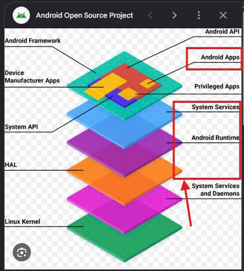

Hi Team. Khi mình phát triển đang base trên nền tàng aaos/aosp mình cần hiểu 1 chút về kiến trúc hệ thống. ()
1. Added Value & Team-owned:
đánh giá trên tiêu chí thực tế chạy của sản phẩm. Hiện tại sản phẩm của team mới sử dụng được một số chức năng đơn giản nên không thể đánh là đạt
2. Độ tích hợp với hệ thống
Được đánh giá "đạt: khi team
- Sử dụng các tài nguyên mặc định của btc: mô hình tiêu chuẩn APP -> FW SW -> VHAL -> Kuksa databroker (GATEWAY-CAN/LIN)->  CCU
- Sử dụng các phương thức kết nối tiêu chuẩn automotive: ETHERNET, SOMEIP(phải triển khai hoàn chỉnh) -> Nếu không hoàn thiện thì chỉ được đánh giá thấy 1 phần
- Sử dụng các phương thức mới tự định nghĩa (phải triển khai hoàn chỉnh ) -> Nếu không hoàn thiện thì chỉ được đánh giá thấy 1 phần

"đạt" ở đây được tính như thế nào: Ít nhất một case thông toàn bộ luồng nếu không toàn bộ đánh giá chỉ thấy 1 phần.

Ví dụ: trên app climate đang show nhiệt độ là N, khi được command tăng N+1 -> gửi xuống Service -> VHAL -> 1 trong các phương thức kết nối ở trên -> CCU -> Trả lại service -> feedback lên app, update UI nhiệt độ N+1

chỉ thấy 1 phần tức là các bạn có làm. Làm đến đâu thì bgk sẽ đánh giá

đoạn CCU trả lại service thì cũng phải đi theo luồng ngược lại chiều đi nhé

không bảo anh viết tắt quá

Dạ vâng, sau khi có thời gian bàn bạc lại và xem lại với team sau khi nghe các giải thích dễ hiểu của anh Đức thì team em xin xác nhận đồng ý với feedback ạ.
