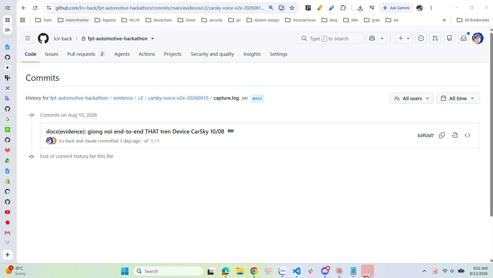

Kính gửi BTC và Mentor ThuyDH,
Team VIVA cảm ơn feedback Vòng 2. Team xác nhận feedback về chuỗi vehicle-control là đúng: team chưa có VivaCarService/AIDL riêng, chưa có bằng chứng setProperty + readback qua CarPropertyManager trên CarSky Device, chưa đóng App → VHAL → CAN → CCU, và Climate ECU hiện tại là thành phần mô phỏng do platform cung cấp. Team không đề nghị thay đổi kết luận này.
Tuy nhiên, team xin BTC xem xét bổ sung các evidence sau cho ba tiêu chí đang được ghi nhận “thấy một phần”:
1. Added Value & Team-owned
DefaultSafetyGuard và GuardedVehicleRepository là phần team tự phát triển, cưỡng chế policy tại biên mọi vehicle write.
Ablation A1: khi bỏ guard, 6/6 ca nguy hiểm ghi được vào MockVehicleRepository; 3/3 ca hợp lệ không đổi: evidence/ablation/a1-safety-guard-ablation.csv.
Ablation grammar A4: bỏ grammar làm 12/22 câu mất lệnh và hai refusal thay đổi thành lệnh: evidence/ablation/a4-grammar-ablation.csv.
Team tự phát triển voice orchestration, typed intent/gateway, dịch vụ viva-asr, benchmark harness và adapter media.
VHAL_BASELINE_MANIFEST.md tách rõ capability provided, new, modified và planned; team không tính tám Script Node hoặc Climate ECU của platform là phần tự xây.
2. Độ sâu tích hợp vào core flow · 4đ

L3 = "bỏ đường tích hợp thì workflow chính thất bại". Đội có hai counterfactual đã đo, không phải lập luận:

a) Bỏ đường tới node ASR trong room → mất sạch lượt thoại. APK build với -PvivaAsrEngine=remote -PvivaAsrBaseUrl=http://10.99.0.3:8080, tức buộc phải gọi node trong room. Bundle README ghi: thiếu network_security_config cho 10.99.0.3 thì "mọi lượt đều chết ở Cleartext HTTP traffic to 10.99.0.3 not permitted — 5 lượt đầu trong phiên gốc chính là như vậy".

b) Mạnh hơn — chính nền tảng chứng minh app là lối vào duy nhất của chuỗi. evidence/carsky/signals-rest-0808/run-manifest.txt đo được rằng ghi VSS từ ngoài không lan xuống CAN:
POST /values  bcm-can           -> {"values":[]}
SSE  bcm-can/subscribe 20 giây  -> chỉ "ping", không frame nào
{"value":23.0,"actuate":true}   -> 200 {"ok":true,"sent":1} nhưng giá trị VẪN 24, timestamp cũ
Khớp với infotainment_gateway.lua: chuỗi VSS → CAN chỉ kích hoạt từ phía VHAL (pins.vhal:on_change → actuate_kuksa). Không có app của đội thì không ai kích được chuỗi đầy đủ của nền tảng — đúng định nghĩa "độ sâu tích hợp".

Giới hạn phải khai kèm: đường VHAL→CAN đó đội chưa chạy (APK là flavor mock). Nên ô này xin L2 chắc chắn, L3 thì để BGK quyết.

3 - Evidence từ platform · 4đ

Barem: "log/trace/output từ CarSky".

- 25 dòng trace thật từ logcat Device - đã có - https://github.com/lcv-back/fpt-automotive-hackathon/blob/main/evidence/c2/carsky-voice-e2e-20260810/capture.log
-  22/22 node Running, trong đó {"displayName":"VIVA ASR","nodeType":"container","phase":"Running"} id          │
│                                                      │ b8eada00-d137-4fdc-a131-2197b1d1356b — node của đội, trong đúng room đã demo - https://github.com/lcv-back/fpt-automotive-hackathon/blob/main/evidence/carsky/signals-rest-0808/00-nodes-live.json

- Vòng ghi→đọc lại thật trên KUKSA: T0 null → T1 POST /actuate 200 {"ok":true,"sent":1} → T2 = 24, timestamp   │
│                                                      │ nhảy đúng 19:34:36.246Z - https://github.com/lcv-back/fpt-automotive-hackathon/blob/main/evidence/carsky/signals-rest-0808/run-manifest.txt

- Image đội push lên registry.hackathon-2.carsky.io/viva/viva-asr, multi-arch, cluster pull được bằng digest   │
│                                                      │ sha256:63c2c56a… - https://github.com/lcv-back/fpt-automotive-hackathon/blob/main/evidence/carsky/v7-manifest.txt

- Định danh Device đọc trực tiếp từ web ADB của CarSky - https://github.com/lcv-back/fpt-automotive-hackathon/blob/main/evidence/c2/device-info.txt

4. Ranh giới và tính tương xứng · 2đ
Barem: "Không được đánh đồng node/container với ECU/vECU/in-car".
đường dẫn: https://github.com/lcv-back/fpt-automotive-hackathon/tree/main/GATEWAY
- VHAL_BASELINE_MANIFEST.md khai 8 Script Node là provided. Kiểm chứng độc lập: diff GATEWAY/Climate ECU.lua và GATEWAY/BCM ECU.lua với scriptContent trong backend/carsky/blueprint-VIVA-deploy-backup.json → Giống nhau.
- v7-manifest.txt tự giới hạn: "Cái này không chứng minh điều gì về latency".
- signals-rest-0808/run-manifest.txt tự giới hạn: "KHÔNG chứng minh core flow của app chạy trên CarSky. Đây là REST gọi thẳng vào KUKSA broker… Bản chất nó là một công cụ ĐO, không phải sản phẩm".
3. User/Customer/Deployment
User trực tiếp: tài xế Việt Nam, ưu tiên tài xế giao vận.
Buyer: OEM/Tier-1 Digital Cockpit; process owner: fleet operations/an toàn đội xe.
Mô hình triển khai B2B/B2B2C và ba giai đoạn developer/emulator → CarSky Device → OEM image được mô tả tại vong2/12-PRODUCT-INTEGRATION-CARD.md.
H1–H4 vẫn là giả thuyết chưa được user/customer validation; team đồng ý tiêu chí này chỉ ở mức “thấy một phần”.
Từ các evidence trên, team kính đề nghị BTC:
Xem xét ghi nhận rõ hơn phần Added Value/Team-owned của team.
Cập nhật diễn đạt “output chỉ dừng ở ứng dụng tầng trên” thành:
“Chuỗi vehicle-control VHAL/CAN/CCU chưa hoàn tất; tuy nhiên team đã có phần team-owned ở voice orchestration, SafetyGuard/ablation, ASR service và một số runtime/platform evidence ngoài chuỗi vehicle-control.”
Giữ nguyên giới hạn: team không claim full-stack vehicle-control hoặc CCU team-owned.
Team VIVA cảm ơn BTC và Mentor đã xem xét.
Sau khi bọn e đã xem lại và có một sô điểm và evidence cụ thể, em có gắn link đến nơi chưa evidence để mn có thể xem chi tiết ạ
Hơi dài, nhưng sợ các anh chưa nhìn thấy nên bọn em đã nói rõ hơn ạ. Mong các anh có thể xem và đánh giá về các phần chưa thể hiện rõ như trên thì có thể tốt hơn ạ. Các anh có thắc mắc ở phần nào có thể tag bọn em, bọn em sẽ giải đáp những điểm chưa rõ ràng ạ

file log từ carsky e commit vào ngày 10/08 đây ạ
