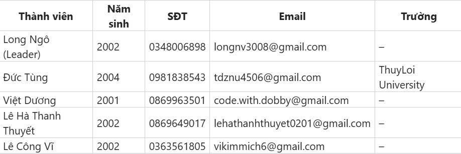
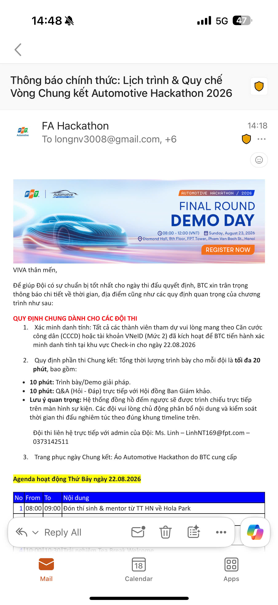
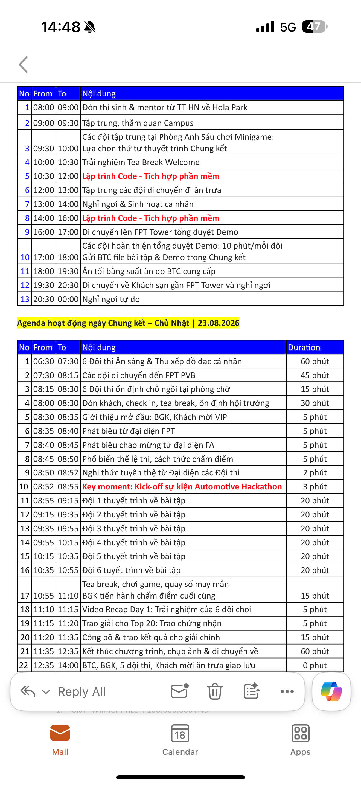
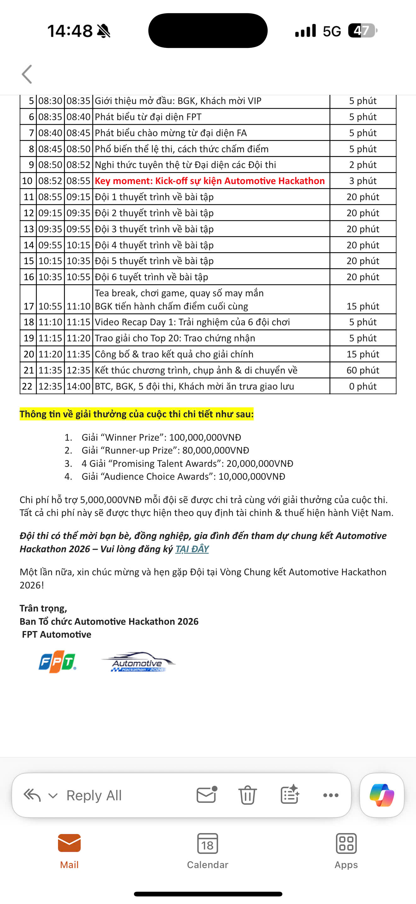

Cả nhà iu ơi, em/mình gửi thông tin đội đã đăng ký, nhờ cả check & confirm giúp nhớ @All

Ban tổ chức nhờ các đội kiểm tra và xác nhận (confirm) lại thông tin thành viên theo danh sách đã đăng ký. Vui lòng rà soát các thông tin sau:
- Họ tên đầy đủ, chính xác
- Số điện thoại và email liên hệ
- Trường học (nếu là học sinh/sinh viên)
- Đội có thành viên nào dưới 16 tuổi không? → Nếu có, thành viên đó cần giấy xác nhận của phụ huynh khi tham gia.

📌 Lưu ý quan trọng:
Mỗi thành viên nhớ mang theo CCCD khi đến sự kiện.
Thông tin trên CCCD phải trùng khớp với danh sách đã đăng ký (họ tên, năm sinh).
Nếu có sai lệch/thay đổi thông tin, vui lòng phản hồi lại BTC trước 17:00, ngày 18/8/2026 (hôm nay) để cập nhật kịp thời.

Dạ Thuyết rời nhóm lâu rùi Linh ơi

Yes, BTC hỗ trợ các đội thi ăn ở 2n1d 22-23/8 ạ
Cụ thể agenda sẽ được gửi lại sau

Time line và lịch trình cụ thể từ BTC trong 3 ảnh sau:

@Long Ngô Logan  cơ hội cho các bạn tự pr: Trong 3 câu làm dc việc sau mô tả nhanh về sản phẩm, phát triển sản phẩm gì, vs mục đích gì và các công nghệ cốt lõi.

cái này map với output của mình nhé

Đây là câu trả lời của nhóm em ạ

1. Sản phẩm là gì?
VIVA là prototype buồng lái số trên Android Automotive OS: tài xế nói lệnh, hệ thống điều khiển HVAC, cửa, đèn cabin, media và trạng thái xe ngay trên màn hình xe.

2. Phát triển gì, mục đích gì?
Chúng em phát triển trợ lý giọng nói cabin (nghe → hiểu lệnh → thực thi → trả lời) để tài xế không cần rời tay khỏi vô-lăng, đồng thời chứng minh luồng lệnh xe đo được, có ranh giới rõ và không bỏ qua tầng an toàn.

3. Công nghệ cốt lõi?
Kotlin + Jetpack Compose trên AAOS, Silero VAD, ASR (Vosk / viva-asr), NLU grammar + embedding, VHAL/CarPropertyManager, MediaSession/ExoPlayer, TTS và SafetyGuard.

Để chi tiết hơn thì nhóm cũng có câu trả lời chi tiết hơn ạ
1. Sản phẩm là gì?
VIVA là prototype buồng lái số (digital cockpit) chạy native trên Android Automotive OS (AAOS) — tức app nằm trên màn hình xe, không phải app điện thoại chiếu lên xe.
Tài xế nói lệnh tiếng Việt, hệ thống nhận lệnh rồi điều khiển các chức năng cabin: điều hòa (HVAC), khóa/mở cửa, đèn cabin, âm lượng, nhạc/radio, và xem trạng thái xe (tốc độ, nhiên liệu, pin…).
Có hai chế độ chạy: mock (giả lập trên emulator để demo/dev) và real (nối VHAL trên thiết bị/xe thật).

2. Phát triển gì, mục đích gì?
Chúng em phát triển trợ lý giọng nói cabin end-to-end: mic → cắt câu (VAD) → nhận dạng giọng (ASR) → hiểu ý định (NLU) → thực thi lệnh xe → trả lời bằng giọng (TTS) và hiện lên HMI.
Mục đích: tài xế thao tác xe không cần rời tay khỏi vô-lăng / mắt khỏi đường, đồng thời chứng minh với mentor/ban giám khảo rằng luồng lệnh là của đội sở hữu, đo được độ trễ, có ranh giới rõ (intent dừng ở app, VHAL chỉ nhận property), và không bỏ qua tầng an toàn — lệnh nguy hiểm bị chặn hoặc hỏi xác nhận trước khi ghi xuống xe.

3. Công nghệ cốt lõi?
Nền tảng: Kotlin, Jetpack Compose, Hilt, Coroutines/Flow, Clean Architecture + MVVM trên AAOS.
Giọng nói: AudioRecord (một nguồn mic) → Silero VAD (cắt câu tiếng Việt) → ASR (Vosk on-device hoặc viva-asr / Google STT) → NLU (grammar T0 + keyword + embedding MiniLM) → TTS kèm audio focus.
Xe & media: CarPropertyManager / VHAL cho HVAC–cửa–đèn; MediaSession + ExoPlayer cho nhạc; SafetyGuard đứng giữa repository để chặn lệnh không an toàn trước khi xuống mock/xe thật.

dài quá
tóm lại trong 3 câu thôi em

VIVA là prototype buồng lái số native trên Android Automotive OS: tài xế nói tiếng Việt, hệ thống điều khiển điều hòa, cửa, đèn cabin, media và trạng thái xe ngay trên màn hình xe. Chúng em phát triển trợ lý giọng nói cabin end-to-end — từ mic, nhận dạng, hiểu lệnh đến thực thi và TTS — để tài xế không rời tay khỏi vô-lăng, đồng thời chứng minh luồng lệnh đo được, có ranh giới rõ và không bỏ qua tầng an toàn. Công nghệ cốt lõi là Kotlin/Compose trên AAOS, Silero VAD, ASR, NLU grammar + embedding, VHAL, MediaSession/ExoPlayer, TTS và SafetyGuard.

chốt kèo chưa. Anh gửi đi cho gk đấy
buồng lái số thì không phải nha
cabin nó nhiều thứ hơn
dựa vào output hiện tại của mình nhé chém quá thì cũng không dc đau

Cho em xin thêm 15 phút ạ
VIVA là app trợ lý giọng nói chạy trên Android Automotive OS: tài xế nói lệnh tiếng Việt, hệ thống điều khiển được một số chức năng trên xe như điều hòa, cửa, đèn cabin, âm lượng và phát nhạc, đồng thời xem trạng thái xe trên màn hình. Chúng em phát triển luồng giọng nói end-to-end — nghe, nhận dạng, hiểu lệnh, thực thi rồi trả lời — để tài xế thao tác những chức năng đó bằng giọng nói, không cần rời tay, và để chứng minh lệnh đi đúng pipeline có đo được và có chặn an toàn. Công nghệ cốt lõi là Kotlin trên AAOS, xử lý giọng nói, hiểu ý định, kết nối tín hiệu xe và phát media.
