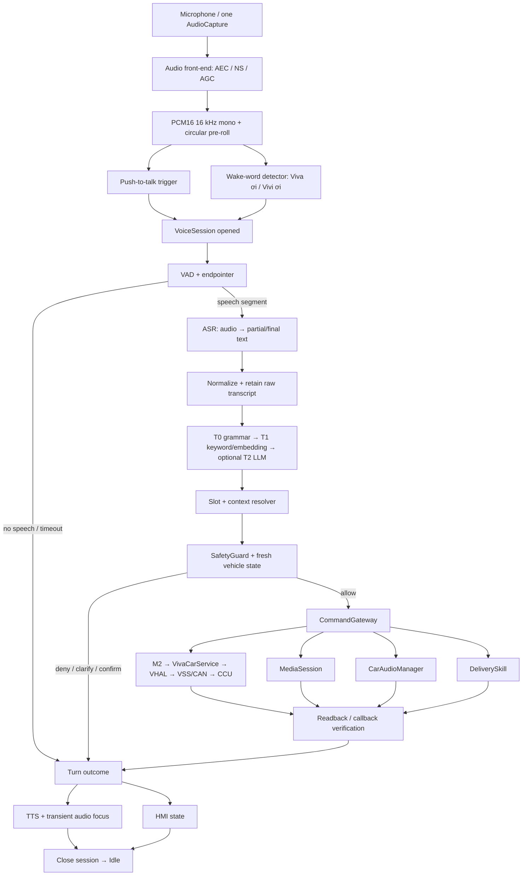
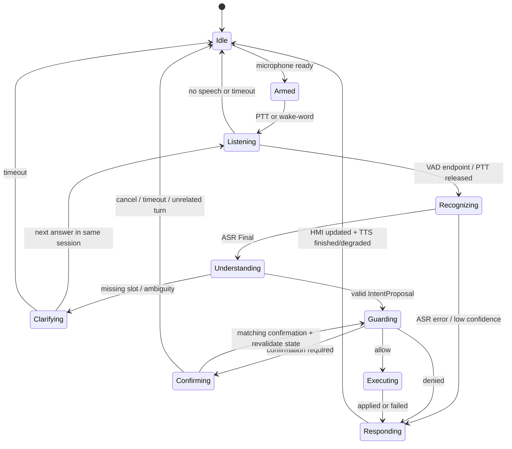

# 28 — Pipeline Voice AI Agent hoàn chỉnh

> **Chủ sở hữu:** Long · **Ngày:** 05/08/2026 · **Trạng thái:** P0 ĐANG TRIỂN KHAI — 4/5 mục đã
> vào source; P1–P3 vẫn là PROPOSED.
>
> **Nguồn đối chiếu:** source tại commit `dd58b2b` (bản review gốc viết trên `0f3c841`); flow đề
> xuất ngày 01/08; research Speech Recognition Chapter 8 do Long cung cấp ngày 05/08; contract
> hiện hành `03-contracts.md`.
>
> Tài liệu này mô tả đồng thời: **APK đang chạy**, **kiến trúc đích**, ranh giới interface và thứ tự
> triển khai. Nó không nâng trạng thái một thành phần từ “có code” thành “đã tích hợp” nếu chưa nằm
> trên đường chạy APK.

---

## 0. Kết luận kiến trúc

Pipeline đích của VIVA là:

```text
MỘT AudioCapture duy nhất
  → Audio Front-end (AEC/NS/AGC của platform, nếu có)
  → [Push-to-talk | Wake-word] kích hoạt một VoiceSession
  → VAD/endpointer + circular pre-roll buffer
  → ASR duy nhất (audio → text; partial chỉ để hiển thị)
  → Normalize
  → NLU phân tầng: Grammar T0 → Keyword/Embedding T1 → LLM T2 tùy chọn
  → Slot/Context Resolver
  → SafetyGuard với trạng thái xe mới nhất
  → CommandGateway
      ├─ vehicle → bảng M2 → VivaCarService → VHAL → VSS/CAN → CCU
      ├─ media   → MediaSession
      ├─ volume  → CarAudioManager
      └─ delivery → DeliverySkill nội bộ
  → readback/callback xác minh kết quả
  → Applied | Denied | ConfirmationRequired | ClarificationRequired | Unsupported | Failed
  → HMI + TTS có audio focus
```

Sáu quyết định không được phá vỡ:

1. **Chỉ một thành phần sở hữu microphone.** VAD, local ASR và remote ASR cùng nhận frame từ một
   nguồn; không thành phần nào tự mở `AudioRecord` thứ hai.
2. **ASR chính là STT.** Khử vọng/lọc nhiễu thuộc audio front-end; VAD chỉ phát hiện/đóng biên
   tiếng nói, không nhận dạng nội dung.
3. **Wake-word và push-to-talk chỉ là hai trigger.** Sau trigger, cả hai đi qua cùng một pipeline;
   không được tạo hai đường NLU/safety/execution khác nhau.
4. **LLM chỉ đề xuất `IntentProposal`.** Nó không trả `passed/fail`, không sinh PropertyID và không
   gọi thẳng Skill/VHAL.
5. **SafetyGuard nằm ở biên mọi lệnh ghi xe.** HMI, voice và system caller đều phải qua guard.
6. **Chỉ nói “Đã…” sau khi readback/callback khớp giá trị mong đợi.** `setProperty()` không ném lỗi
   mới chỉ là “request được nhận”, chưa đủ để gọi là `Applied`.

---

## 1. Review pipeline hiện tại tại `dd58b2b`

> **Cập nhật 05/08 chiều:** P0.1, P0.2, P0.3 và P0.5 đã được triển khai; mục 1 dưới đây mô tả
> đường chạy **sau** khi hợp nhất. Bản mô tả cũ (Vosk tự mở `AudioRecord`) áp dụng cho `0f3c841`
> trở về trước. Xem §8 để biết mục nào của P0 còn lại.
>
> Xanh ở đây nghĩa là **JVM test + build APK**, chưa phải evidence chạy thật. Chưa có lượt nào
> được quay trên emulator hay CarSky Device với đường mới; đừng nâng nó thành claim.

### 1.1 Đường APK thực chạy

```text
ACTION_START_LISTENING / nút mic
  → VoiceAssistantService                          [chủ sở hữu session]
  → AudioCapture duy nhất (AndroidPcmSource)       [chỗ mở microphone duy nhất trong repo]
      → Flow<PcmFrame> 512 mẫu, PCM16 16 kHz mono, timestamp đơn điệu
  → VadStreamDriver (Silero VAD + VadEndpointer + circular pre-roll)
      → speech_start / speech_end back-date theo sample timestamp
      → requestEndOfUtterance() ngay trong khung endpoint
  → VoskSpeechRecognitionEngine                    [consumer của cùng dòng khung]
      → TranscriptionEvent.Partial → chỉ cập nhật HMI
      → TranscriptionEvent.Final(text, acousticConfidence=null, engineMs)
  → ProcessVoiceCommandUseCase
      → GrammarIntentRouter T0
      → keyword mapping
      → MiniLM ONNX embedding fallback T1
  → ExecuteVehicleControlUseCase
  → GuardedVehicleRepository → DefaultSafetyGuard
  → mock/real VehicleRepository
  → HMI state + AndroidTtsSpeaker
```

### 1.2 Thành phần và trạng thái tích hợp

| Thành phần | Code hiện có | Trạng thái tích hợp |
|---|---|---|
| AudioCapture duy nhất | `AudioCapture`, `PcmSourceAudioCapture`, `AndroidPcmSource` | **Trên đường chạy APK**; `AndroidPcmSource` là `AudioRecord` duy nhất còn lại trong repo |
| Silero VAD live | `SileroVadOnnxScorer`, `VadEndpointer`, `VadStreamDriver` | **Trên đường chạy APK**, có pre-roll 500ms; ngưỡng vẫn là baseline synthetic |
| ASR theo khung PCM | `SpeechRecognitionEngine.transcribe(Flow<PcmFrame>)`, Vosk + remote PhoWhisper adapters | **Trên đường chạy APK**; Vosk là mặc định, PhoWhisper chọn bằng build property; không engine nào sở hữu mic |
| Acoustic confidence | `TranscriptionEvent.Final.acousticConfidence: Float?`, `AsrResult.acousticConfidence` | Có contract; Vosk trả `null` **có chủ đích**, không bịa 1.0 |
| Push-to-talk hold | `PushToTalkRecorder` | Chưa dùng: HMI hiện là **chạm để nói**, chưa có cử chỉ giữ nút. Nhả nút chưa phải tín hiệu endpoint |
| Voice orchestration | `VoiceAgent`, `CommandGateway`, `CommandResult` | **Vẫn chưa nằm trên đường chạy** — xem §8 P0.4 |
| Adapter `AsrClient` thật | `AsrClient`, `FakeAsrClient` | Chưa có adapter thật; app đi qua `SpeechRecognitionEngine` |
| Wake-word | VIA + AlwaysOnHotwordDetector (DSP, reflection) + software KWS fallback “Vi-Vi ơi”; mặc định tắt đến khi FA/FR đạt ngưỡng | Đã có skeleton/code; OEM sound model + ROLE_ASSISTANT vẫn cần image privileged |
| Remote PhoWhisper | `RemotePhoWhisperSpeechRecognitionEngine`, `HttpRemoteAsrTransport` | **Đã nối ở source, opt-in** bằng `-PvivaAsrEngine=remote`; unit test xanh, chưa có emulator/Device evidence |
| `VivaCarService` | Chưa có | App vẫn gọi repository nội bộ |

### 1.3 Phần đã thay đổi sau snapshot `25-LECH-KIEN-TRUC-VOICE-PIPELINE.md`

File `25` đúng cho snapshot 04/08 nhưng không còn là trạng thái mới nhất. `SafetyGuard` đã có thật:
`DefaultSafetyGuard` được bọc bởi `GuardedVehicleRepository`, nên mọi caller ghi property đều đi
qua guard. Ba khoảng trống còn lại của snapshot cũ, tính tới `dd58b2b`:

- ~~`TranscriptionEvent.Final` chỉ có `text`, chưa có acoustic confidence.~~ Đã có
  `acousticConfidence: Float?`; Vosk trả `null` và luật low-confidence chỉ chạy khi có số thật.
- ~~Vosk vẫn tự sở hữu microphone và endpoint; Silero VAD chưa được cắm.~~ Đã hợp nhất: một
  `AudioCapture`, VAD chạy trước ASR trong cùng khung và là bên quyết định endpoint.
- `VoiceAgent` và `AsrClient` **vẫn** chưa phải đường orchestration của APK.

---

## 2. Pipeline đích



### 2.1 Hai trigger, một đường sau trigger

**Push-to-talk là trigger mặc định của MVP:** dễ kiểm thử, không có false wake, người dùng biết rõ
khi nào mic hoạt động. Nhả nút là tín hiệu endpoint cứng; VAD được dùng để trim khoảng lặng và phát
hiện lượt bấm rỗng.

**Wake-word là trigger hands-free:** detector luôn chạy on-device trên frame nhẹ. Một circular buffer
giữ audio ngay trước/sau thời điểm phát hiện để câu *“Viva ơi, hạ điều hòa xuống 24 độ”* nói liền
mạch không bị mất âm đầu của phần command. Wake-word detector không được gửi audio liên tục lên
cloud.

Trong lúc TTS đang phát, MVP tạm ngưng wake-word để tránh trợ lý tự đánh thức bởi giọng của chính
nó. Barge-in/full-duplex chỉ mở sau khi AEC được đo bằng audio thật.

### 2.2 Audio front-end

Đầu vào chuẩn của pipeline:

| Trường | Contract |
|---|---|
| Encoding | PCM signed 16-bit little-endian |
| Sample rate | 16 kHz |
| Channel | mono |
| Frame | 512 samples cho Silero VAD; frame mang timestamp monotonic |
| Source | `VOICE_RECOGNITION` hoặc cấu hình đã benchmark |

AEC/NS/AGC của platform là adapter có thể bật/tắt để A/B. Không thêm một model enhancement chỉ vì
audio “nghe sạch hơn”; quyết định bằng WER, intent accuracy, clipping và latency.

### 2.3 VAD/endpointer

VAD xử lý frame 10–32 ms, tạo xác suất speech. `VadEndpointer` áp hysteresis, minimum speech,
hangover/minimum silence và maximum utterance. Driver streaming còn thiếu phải:

1. giữ circular pre-roll buffer;
2. cấp frame tuần tự cho scorer;
3. mark `speech_start`/`speech_end` theo sample timestamp;
4. phát đúng một `AudioUtterance` sau endpoint;
5. reset recurrent state khi đóng session.

Baseline hiện tại `threshold=0.50`, `negativeThreshold=0.35`, `minSpeech=250ms`,
`minSilence=100ms`, `speechPad=30ms` chỉ là baseline synthetic. Tune cabin/device phải dựa trên
missed utterance, false activation, onset/offset error và endpoint latency.

### 2.4 ASR

ASR nhận audio, trả text; không nhận responsibility “lọc tiếng ồn”. Partial transcript chỉ cập nhật
HMI, **không bao giờ được route/execute**. Chỉ `Final` mới đi xuống NLU.

Contract đích phải giữ riêng hai confidence:

- `acousticConfidence`: ASR nghe âm thanh chắc đến đâu; có thể `null` nếu engine không cung cấp.
- `nluConfidence`: router/classifier chắc intent đến đâu.

Không gán `1.0` giả cho engine không có confidence. Guard chỉ chạy luật low-confidence khi thật sự có
dữ liệu đã được hiệu chỉnh; thiếu confidence là một trạng thái quan sát được, không phải “chắc chắn”.

Vosk on-device là adapter mặc định offline. PhoWhisper remote là adapter tùy chọn khi có đường mạng
đã kiểm chứng. Hai adapter phải dùng cùng audio/session contract; không adapter nào tự mở mic.

### 2.5 Normalize và NLU phân tầng

Normalize giữ cả `rawText` và `normalizedText`, chuẩn hóa whitespace/dấu câu/casing và từ số tiếng
Việt. Wake phrase được detector loại khỏi audio command; router vẫn strip prefix để tương thích PTT
hoặc trường hợp ASR còn trả prefix.

Thứ tự NLU:

1. **T0 Grammar:** 10 intent lõi, deterministic, ưu tiên cho vehicle/safety-critical command.
2. **T1 Keyword mapping:** fallback nhanh cho synonym đã biết.
3. **T1 Embedding:** MiniLM ONNX chọn candidate theo cosine threshold.
4. **T2 LLM — tùy chọn, chưa thuộc MVP:** chỉ trả JSON/typed `IntentProposal` trong allowlist.

Mọi tier trả cùng một kiểu dữ liệu; tier sau chỉ chạy khi tier trước cho phép fallback. Một lệnh bị
grammar xác định là “unsupported có chủ đích” không được embedding/LLM cứu thành lệnh xe.

### 2.6 Slot và context resolver

Resolver biến đề xuất ngôn ngữ thành lệnh đủ slot nhưng không tự đoán hành động nguy hiểm:

- *“Hạ nhiệt độ xuống 24 độ”* → absolute `SetTemperature(24)`.
- *“Giảm nhiệt độ”* → thiếu mức đích theo policy MVP → hỏi lại, hoặc chỉ dùng delta mặc định nếu team
  đã chốt công khai policy đó.
- *“Lạnh quá”* có nghĩa người dùng muốn **ấm hơn**, không phải lạnh hơn. Hiện tại hỏi
  *“Bạn muốn tăng nhiệt độ lên bao nhiêu độ?”* là đúng và an toàn.
- Relative command chỉ được đổi thành absolute target sau khi đọc setpoint hiện tại thành công.

Slot sai kiểu, thiếu, `NaN` hoặc ngoài range dừng tại boundary; không biến thành default vehicle
command.

### 2.7 SafetyGuard và confirmation

Guard nhận `VehicleWriteRequest` + snapshot trạng thái xe mới nhất. Thứ tự verdict:

1. từ chối hazard/range trước;
2. nếu không hazard, xử lý low confidence;
3. sau đó mới hỏi xác nhận hành động nhạy cảm;
4. còn lại `Allow`.

Confirmation là một state của session, không phải boolean toàn cục:

- token gắn với fingerprint của intent/slots;
- có TTL;
- câu trả lời khác hủy token;
- khi xác nhận phải đọc lại trạng thái xe và chạy guard lần nữa;
- xác nhận không được bypass tốc độ/số xe đã thay đổi.

`GuardedVehicleRepository` hiện đã đảm bảo mọi write qua guard. Khi `VivaCarService` xuất hiện,
chuyển guard vào service để policy nằm cùng nơi sở hữu kết nối `CarPropertyManager`.

### 2.8 CommandGateway và xác minh thực thi

Gateway phân loại theo domain, không theo câu chữ:

| Domain | Đường thực thi | Qua VHAL? |
|---|---|---|
| HVAC/door | `CoreIntentMapper` → M2 → `VivaCarService` → VHAL → VSS/CAN | Có |
| Media | `MediaSession` | Không |
| Volume | `CarAudioManager` | Không |
| Delivery | `DeliverySkill` nội bộ | Không |

Kết quả gateway là discriminated union ổn định:

```kotlin
sealed interface CommandResult {
    data class Applied(val spokenVi: String, val hmiPatch: Map<String, Any>) : CommandResult
    data class Denied(val rule: String, val reasonVi: String) : CommandResult
    data class ConfirmationRequired(val token: String, val questionVi: String) : CommandResult
    data class Failed(val stage: String, val diagnostic: String) : CommandResult
}
```

`Applied` yêu cầu:

- HVAC setpoint: callback/readback property setpoint khớp target; không chờ nhiệt độ cabin thực đạt
  target.
- Fan/door: callback/readback khớp level/boolean mong đợi.
- Media/volume: adapter trả trạng thái player/volume mới.
- Delivery: transaction nội bộ hoàn tất.

Timeout, permission error, unavailable property hoặc readback mismatch đều là `Failed`; tuyệt đối
không nói “Đã…”.

### 2.9 Response, HMI và TTS

Một `TurnOutcome` duy nhất cấp dữ liệu cho cả HMI và TTS để hai kênh không nói khác nhau:

| Outcome | Ví dụ phản hồi |
|---|---|
| Applied | “Đã đặt nhiệt độ mục tiêu 24 độ C.” |
| Denied | “Xe đang chạy, mình chưa mở khoá cửa được.” |
| ConfirmationRequired | “Bạn có chắc muốn mở khoá cửa không?” |
| ClarificationRequired | “Bạn muốn đặt nhiệt độ ở bao nhiêu độ?” |
| Unsupported | Nói rõ phạm vi trợ lý hỗ trợ |
| Failed | “Mình chưa thực hiện được yêu cầu. Bạn thử lại giúp mình nhé.” |

TTS xin transient audio focus, phát tiếng Việt và trả focus trong mọi nhánh. TTS thất bại không rollback
một command đã được xác minh; HMI vẫn hiển thị kết quả và log ghi degraded output.

---

## 3. State machine của một lượt thoại



Mỗi `VoiceSession` chỉ có một active turn. Lượt mới hủy partial/confirmation cũ trừ khi nó là câu trả
lời đúng cho prompt đang chờ.

---

## 4. Interface đích tối thiểu

```kotlin
data class PcmFrame(
    val samples: ShortArray,
    val sampleRate: Int = 16_000,
    val startNanos: Long,
)

data class AudioUtterance(
    val pcm16: ShortArray,
    val sampleRate: Int,
    val speechStartNanos: Long,
    val speechEndNanos: Long,
    val trigger: Trigger,
)

enum class Trigger { PUSH_TO_TALK, WAKE_WORD }

sealed interface TranscriptionEvent {
    data class Partial(val text: String) : TranscriptionEvent
    data class Final(
        val text: String,
        val acousticConfidence: Float?,
        val engineMs: Int,
    ) : TranscriptionEvent
    data class Error(val code: String, val diagnostic: String) : TranscriptionEvent
}

data class IntentProposal(
    val name: String,
    val slots: Map<String, Any>,
    val tier: Tier,
    val nluConfidence: Float?,
    val rawText: String,
    val normalizedText: String,
)
```

Quy tắc interface:

- input bên ngoài được validate một lần tại boundary;
- error có code máy đọc được, không chỉ có message;
- field mới phải additive/optional;
- không truyền Android type vào `:voice-core`;
- không dùng cùng một trường `confidence` cho cả ASR và NLU.

---

## 5. Xử lý lỗi theo từng tầng

| Tầng | Lỗi | Hành vi |
|---|---|---|
| Trigger | False wake nhưng không có command | timeout ngắn rồi về Idle; không gọi ASR/vehicle |
| Capture | Mic unavailable/read error | HMI error + cue/TTS nếu khả dụng; `Error:speech_start` |
| VAD | Không speech hoặc max duration | hỏi nói lại; không gửi segment rỗng |
| ASR | timeout/error/blank | hỏi nói lại; không chạy NLU |
| ASR | confidence thấp | clarification; không biến text nghi ngờ thành lệnh nhạy cảm |
| NLU | thiếu slot | hỏi đúng slot thiếu |
| NLU | unsupported | nói rõ phạm vi; không gọi Skill |
| Guard | deny | nói lý do + gợi ý; không write |
| Guard | confirm | lưu token; không write trước khi xác nhận |
| Execute | permission/timeout/unavailable | `Failed`; không nói “Đã…” |
| Verify | readback mismatch | `Failed`; log expected/actual |
| TTS | engine/focus/fallback đều lỗi | giữ kết quả command + HMI; log output degraded |

---

## 6. Observability và benchmark

Giữ nguyên chín `Stage` và wire format `VIVA_TRACE` để không phá harness của Vĩ:

```text
speech_start → speech_end → asr_sent → asr_done → nlu_done
→ guard_done → exec_done → render_done → tts_start
```

Wake-word/VAD diagnostics mới đi tag riêng `VIVA_VOICE`, không chen dòng vào `VIVA_TRACE`.

| Tầng | Metric |
|---|---|
| Wake-word | false accepts/hour, false reject rate, trigger latency |
| VAD | TPR/FPR, missed utterance, FEC/MSC/OVER, onset/offset error, endpoint latency |
| ASR | WER/CER, blank rate, real-time factor, p50/p95, theo noise/speaker |
| NLU | intent accuracy, slot F1, clarification rate, unsafe fallback count |
| Safety | verdict/rule distribution, false allow/false deny trên safety suite |
| Execution | command success, permission error, timeout, readback mismatch |
| Product | `speech_end → tts_start`, HMI render latency, task success rate |

Lượt fail vẫn nằm trong mẫu. Báo cáo phải tách `synthetic`, `local emulator`, `CarSky Device` và
`cabin/real-world`; không trộn thành một con số p95/WER.

Raw audio mặc định không lưu. Chỉ lưu khi bật debug/evidence có chủ đích, có thời hạn xóa và không
chứa voiceprint. Log không ghi API key, token hoặc audio embedding.

---

## 7. Ánh xạ research vào phạm vi sản phẩm

| Nội dung research | Vai trò trong VIVA | Quyết định |
|---|---|---|
| VAD | xác định speech boundary, giảm audio rỗng và endpoint latency | **Core** |
| Wake-word | hands-free trigger on-device | **Target**, PTT vẫn là fallback/MVP |
| Keyword spotting | shortcut nhẹ cho keyword đơn giản | Chỉ dùng như T0/T1; không bypass ASR/guard |
| ASR | audio → text | **Core** |
| Speaker verification/identification | xác thực/nhận dạng danh tính bằng voiceprint | **Không đưa vào MVP**: chưa có use case, consent, anti-spoofing |
| Speaker diarization | “ai nói khi nào” trong hội thoại nhiều người | **Không cần** cho single-command assistant; chỉ cân nhắc meeting/multi-seat future |
| Paralinguistic processing | cảm xúc, mệt mỏi, buồn ngủ | **Tách thành feature an toàn riêng**; không dùng để tự động thực thi lệnh xe |
| Speech enhancement | AEC/NS/AGC/denoise | A/B bằng WER/clipping/latency; không mặc định thêm model |

Research giúp đặt đúng vai trò các mô-đun, nhưng các con số hiệu năng tổng quát không được dùng làm
claim của đội. Claim chỉ lấy từ benchmark tái lập trên dữ liệu và Device của VIVA.

---

## 8. Thứ tự triển khai ít rủi ro nhất

### P0 — Hợp nhất đường chạy hiện tại

1. ✅ **Xong** (`9153d16`) — `AudioCapture` duy nhất phát `Flow<PcmFrame>`, khung 512 mẫu.
2. ✅ **Xong** (`dd58b2b`) — `VoskSpeechRecognitionEngine` nhận frame; `AndroidPcmSource` là
   `AudioRecord` duy nhất còn lại trong repo.
3. ✅ **Xong** (`9153d16`) — `VadStreamDriver`: live driver cho `VadEndpointer`, circular pre-roll
   500ms, back-date `speech_start`/`speech_end` theo sample timestamp, đúng một `AudioUtterance`
   mỗi session, `reset()` xóa recurrent state.
4. ⬜ **Chưa** — nối `VoiceAgent` hoặc hợp nhất orchestration của nó vào `VoiceAssistantService`.

   Chặn ở một chỗ cụ thể: `VoiceAgent` nhận `com.viva.voice.intent.Intent`, còn tầng T1
   (keyword + MiniLM embedding) của `ProcessVoiceCommandUseCase` sinh thẳng `VehicleIntent` mà
   không đi qua kiểu chung đó. Muốn nối được thì T1 phải trả cùng `Intent` như T0, và
   `CoreIntentMapper` phải phủ thêm `hvac_ac`, `hvac_power`, `vehicle_status_*` cùng hai biến thể
   `adjust`. Đó chính là điều kiện "mọi tier trả cùng một kiểu dữ liệu" ở §2.5 — nên nó là **một
   slice riêng, làm trước khi nối**, không phải phần phụ của việc nối.

   Trong lúc chưa xong, `VoiceAssistantService` là orchestrator sống duy nhất; `VoiceAgent` có
   code và test nhưng không ai gọi. Đây là món nợ đã biết, không phải trạng thái đích.
5. ✅ **Xong** (`dd58b2b`) — `acousticConfidence: Float?` trên `TranscriptionEvent.Final` và
   `AsrResult`; Vosk trả `null`, luật low-confidence chỉ chạy khi có số thật đã đo.

### P1 — Đóng core vehicle loop

1. Dựng `VivaCarService` và chuyển guard + property ownership vào service.
2. Thực thi bảng M2.
3. Thêm readback/callback timeout để phân biệt `Accepted` và `Applied`.
4. Chạy một lượt Device: temperature, fan, door deny/confirm, HMI, TTS, trace.

### P2 — Hands-free và độ bền

1. Thu bộ audio benchmark gồm positive, near-miss và noise-only.
2. Chọn wake-word model theo false accepts/hour + FRR + latency.
3. Tích hợp wake-word vào cùng capture/session, giữ PTT fallback.
4. Tune VAD/AEC/NS trên audio cabin hoặc audio được gắn nhãn đúng nguồn.

### P3 — Tùy chọn sau MVP

- ✅ remote PhoWhisper adapter đã vào source (opt-in; chưa có emulator/Device evidence);
- LLM T2 theo typed schema + allowlist;
- barge-in/full-duplex;
- multi-seat/diarization;
- paralinguistic driver monitoring như một subsystem riêng.

---

## 9. Definition of Done

Pipeline chỉ được gọi là “hoàn chỉnh” khi có đủ. Trạng thái tính tới `dd58b2b`:

- [x] Một owner microphone; không có hai `AudioRecord` hoạt động song song.
      `grep -rn 'AudioRecord('` toàn repo chỉ còn một kết quả: `AndroidPcmSource.kt:49`.
- [ ] PTT chạy end-to-end qua đúng pipeline; wake-word nếu bật cũng đi cùng đường đó.
      Đường mic→VAD→ASR đã hợp nhất, nhưng trigger hiện là **chạm để nói**, chưa phải giữ nút;
      và chưa có lượt nào được chạy thật trên emulator/Device với đường mới.
- [~] VAD live có pre-roll và evidence onset/offset/timeout.
      Pre-roll và back-date có, kèm test JVM. **Evidence onset/offset/timeout trên audio thật thì
      chưa** — ngưỡng vẫn là baseline synthetic ở §2.3.
- [x] ASR Final có text và confidence thật hoặc `null` minh bạch.
- [ ] Grammar/embedding/LLM đều trả cùng `IntentProposal`; không tier nào bypass guard.
      Không tier nào bypass guard (mọi tier đổ về `ExecuteVehicleControlUseCase` →
      `GuardedVehicleRepository`), nhưng T1 chưa trả cùng kiểu với T0 — xem §8 P0.4.
- [ ] Mọi vehicle write đi qua SafetyGuard và `VivaCarService`.
      Qua SafetyGuard: có. `VivaCarService`: chưa tồn tại (P1).
- [ ] Confirmation không write trước, có token/expiry và revalidate trạng thái.
      Không write trước và có revalidate; **chưa có token/expiry** — hiện là cờ hai lượt.
- [ ] `Applied` có readback/callback; error không nói “Đã…”.
- [x] HMI và TTS dùng cùng outcome; TTS có audio focus và fallback.
- [~] Trace đủ chín stage hoặc có `Error:<stage>`; lượt lỗi không bị lọc khỏi benchmark.
      **Ô này tick sai, sửa 08/08.** `Stage.GUARD_DONE` và `Stage.RENDER_DONE` có
      trong enum (`Trace.kt:23,25`) và **được harness Go parse** (`trace.go:15,17`),
      nhưng `grep -rn "Stage.GUARD_DONE"` toàn repo không ra một lời gọi `mark()`
      nào trong mã sản phẩm. Hệ quả trong `report.go`: bốn đoạn `safety_guard`,
      `skill_exec`, `hmi_render`, `tts_kickoff` cộng `screen_latency` **không bao
      giờ có mẫu** — 5/12 chỉ số của mọi báo cáo harness luôn trống.
      `e2e_computed` (`speech_end → tts_start`) thì vẫn tính được.

      **Vì sao chưa vá:** guard chạy bên trong `GuardedVehicleRepository`, mà
      module `vehicle-service` không phụ thuộc `:voice-core` nên không thấy
      `LatencyTrace`. Ba đường đã cân:
      (a) mark `guard_done` ngay trước `exec_done` ở `VoiceAssistantService` →
          `skill_exec` sẽ luôn bằng 0 ms, tức **bịa một con số**;
      (b) nhét lambda vào `VehicleWriteContext` → nó là `data class` dùng trong
          so sánh bằng ở test, thêm lambda là phá `equals`;
      (c) plumb `LatencyTrace` xuống `vehicle-service` → đúng nhất, nhưng là đổi
          ranh giới module, không nên làm hai ngày trước freeze.
      Theo đúng nguyên tắc của chính đội ở `DefaultSafetyGuard` — *"một phép kiểm
      chạy trên hai đồng hồ khác gốc sẽ luôn cho kết quả sai, và sai kiểu đó tệ
      hơn là không kiểm"* — chọn **để trống và khai rõ**, thay vì (a).
- [ ] Có test JVM + emulator + ít nhất một evidence end-to-end trên đúng Device được claim.
      Test JVM: có. Emulator và Device với đường mới: **chưa chạy lần nào**.
